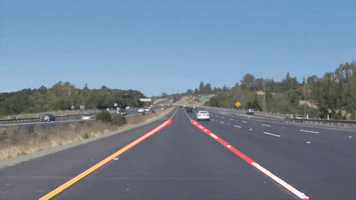

# Introduction
This project detects highway lane lines on a video stream. Used OpencV image analysis techniques to identify lines, including Hough Transforms and Canny edge detection.

If you more curios about how it runs in real time then this video might help.

 

## Dependencies 

* [Python 3.5](https://www.python.org/downloads/) or greater. 
* [OpenCV](http://opencv.org/about.html) library for image processing. 
    * ```pip3 install opencv```
* [Matplotlib](https://matplotlib.org/) for plotting purposes. 
    * ```pip3 install matplotlib```
* [Jupyter Notebook](http://jupyter.org/install.html)

## Running Code

Fully functional code is a Jupyter Notebook file. All you have to do is open P1.ipynb file in Jupyter notebook and click cell-> run all.


## Meta

Ramiz Raja – informramiz@gmail.com

Distributed under the MIT license. See ``LICENSE`` for more information.

[https://github.com/informramiz](https://github.com/informramiz)

## Contributing

1. Fork it (<https://github.com/informramiz/Lane-Finding/fork>)
2. Create your feature branch (`git checkout -b feature/fooBar`)
3. Commit your changes (`git commit -am 'Add some fooBar'`)
4. Push to the branch (`git push origin feature/fooBar`)
5. Create a new Pull Request
